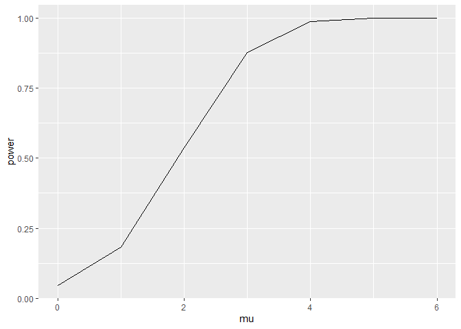

P8105 HW5 jam2530
================
Jenna Mohammed
2023-11-12

``` r
library(tidyverse)
library(rvest)
library(purrr)
library(dplyr)
library(ggplot2)
```

# Problem 2

Creating a tidy dataframe using list

``` r
# listing all files using list.files

file_names <- list.files(path="./hw5_data./data", pattern="\\.csv$", all.files=FALSE, full.names=TRUE)
```

``` r
# create function to read files

all_data <- map_df(file_names, ~ {read.csv(.x)

})
```

``` r
# cleaning and tidying data 

cleaned_df <- all_data |>
  janitor::clean_names() |>
  mutate(subject_ID = as.integer(str_extract(file_names, "[0-9][0-9]"))) |>
  mutate(arm = ifelse(str_detect(file_names, "con") == TRUE, "Control", "Experiment")) 
```

Making a Spaghetti Plot

``` r
cleaned_df_new = 
 cleaned_df|>
  pivot_longer(week_1:week_8,
               names_to = "week",
               values_to = "outcome",
               names_prefix = "week_"
               ) |>
  mutate(week = as.numeric(week))

spaghetti_plot <- cleaned_df_new |>
  ggplot(aes(x = week, y = outcome,
             group = subject_ID, color = arm)) +
  geom_path() +
  facet_grid(~arm)
```

the `spaghetti_plot` above depicts the observations of each participant
in the longtitudal study over the course of 8 weeks

# Problem 3

Setting design elements

``` r
set.seed(12345)

n <- 30

sigma <- 5

mu <- 0:6

alpha <- 0.05

dataset_total <- 5000

iteration = 1:5000
```

Creating function for hypothesis testing

``` r
set.seed(12345)

sigma <- 5

dataset_total <- 5000

iteration = 1:5000

t_test_sim = function(n=30, mu=2, sigma=5) {

  test = tibble(

    x=rnorm(n = n, mean = mu, sd = sigma))

  t_test_results = t.test(x ~ 1, data =test)

  t_test_results|>

    broom::tidy()

}

sim_results =

   tibble(mu = 0:6) |>

   mutate(

    estimate_df = map(.x = mu, ~rerun(dataset_total, t_test_sim(n=30, mu = .x))),

    estimate_dfs = map(estimate_df, bind_rows))|>

    select(-estimate_df)
```

    ## Warning: There was 1 warning in `mutate()`.
    ## i In argument: `estimate_df = map(.x = mu, ~rerun(dataset_total, t_test_sim(n =
    ##   30, mu = .x)))`.
    ## Caused by warning:
    ## ! `rerun()` was deprecated in purrr 1.0.0.
    ## i Please use `map()` instead.
    ##   # Previously
    ##   rerun(5000, t_test_sim(n = 30, mu = .x))
    ## 
    ##   # Now
    ##   map(1:5000, ~ t_test_sim(n = 30, mu = .x))

``` r
sim_results
```

    ## # A tibble: 7 x 2
    ##      mu estimate_dfs        
    ##   <int> <list>              
    ## 1     0 <tibble [5,000 x 8]>
    ## 2     1 <tibble [5,000 x 8]>
    ## 3     2 <tibble [5,000 x 8]>
    ## 4     3 <tibble [5,000 x 8]>
    ## 5     4 <tibble [5,000 x 8]>
    ## 6     5 <tibble [5,000 x 8]>
    ## 7     6 <tibble [5,000 x 8]>

``` r
sim_results =

sim_results %>%

unnest(estimate_dfs) %>%

select(mu, estimate, p.value) %>% mutate(significant = as.numeric(p.value < 0.05))
```

``` r
sim_results %>%

  group_by(mu) %>%

  summarize(power = mean(significant)) %>%

  ggplot(aes(x = mu, y = power)) +

  geom_path()
```

<!-- -->

Plot of Test of Power

``` r
power_df <- sim_results |>
  group_by(mu) |>
  mutate(reject_null = p.value < 0.05) |>
  summarize(power_var = mean(reject_null)) 

power_plot <- power_df |> 
  ggplot(aes( x = mu, y = power_var )) +
  geom_path() +
  labs( 
    x = "Mu (True Mean)",
    y = "Power",
    title = "Power of Test versus True Mean Values")
```

Plot of Average Estimates

``` r
estimate_plot_df <- sim_results |>
  group_by(mu) |>
  mutate(reject_null = p.value < 0.05) |>
  mutate(avg_estimate = mean(estimate)) |>
  mutate(avg_est_reject = mean(estimate[reject_null]))

estimate_plot <- estimate_plot_df |>
  ggplot(aes( x = mu)) +
  geom_line(aes(y = avg_estimate, color = "Average Estimate")) +
  geom_point(aes(y = avg_estimate, color = "Average Estimate")) +
  geom_line(aes(y = avg_est_reject, color = "Average Estimate Alpha < 0.05")) +
  geom_point(aes(y = avg_est_reject, color = "Average Estimate Alpha < 0.05")) +
  labs( x = "True Mean Values",
        y = "Average Estimate of Mu Hat",
        title = "Average Estimate of the True Mean")
```
