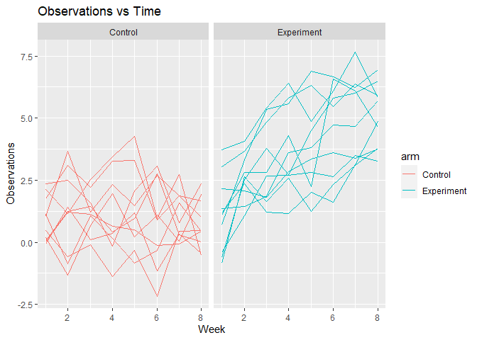

P8105 HW5 jam2530
================
Jenna Mohammed
2023-11-12

``` r
library(tidyverse)
library(rvest)
library(purrr)
library(dplyr)
library(ggplot2)
```

# Problem 2

Creating a tidy dataframe using list

``` r
# listing all files using list.files

file_names <- list.files(path="./hw5_data./data", pattern="\\.csv$", all.files=FALSE, full.names=TRUE)
```

``` r
# create function to read files

all_data <- map_df(file_names, ~ {read.csv(.x)

})

 #reading_files = function(x) {
  
#  files_df = read_csv("./hw5_data/data") |>
#    mutate( data = file_names, read_csv)
#}


#output = map(file_names, read_csv)
```

``` r
# cleaning and tidying data 

cleaned_df <- all_data |>
  janitor::clean_names() |>
  mutate(subject_ID = as.integer(str_extract(file_names, "[0-9][0-9]"))) |>
  mutate(file_names = ifelse(str_detect(file_names, "con") == TRUE, "Control", "Experiment"))
```

Making a Spaghetti Plot

``` r
cleaned_df |>
  gather(week, observations, -subject_ID, -file_names)|>
  ggplot(aes( x = week, y = observations, color = subject_ID)) + 
  geom_line()
```

<!-- -->
